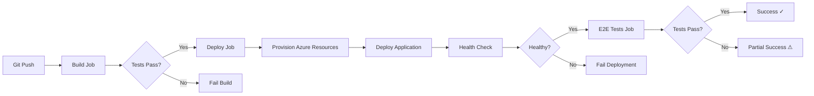

# Phase 5: GitHub Actions CI/CD - Complete ✅

## Overview
Automated CI/CD pipeline using GitHub Actions and Azure Developer CLI (azd) for continuous deployment to Azure App Service.

## What Was Created

### 1. GitHub Actions Workflow
**File**: `.github/workflows/azure-dev.yml`

**Jobs**:
1. **build** - Compiles solution, runs tests, creates artifacts
2. **deploy** - Provisions Azure resources and deploys application
3. **e2e-tests** - Runs end-to-end Playwright tests against deployed app

**Triggers**:
- Push to `main` or `001-podropsquare-is-a` branches
- Pull requests to `main` or `001-podropsquare-is-a`
- Manual workflow dispatch

**Security**: Uses OpenID Connect (OIDC) for authentication - no long-lived secrets needed!

### 2. Setup Documentation
**File**: `.github/CICD-SETUP.md`

Complete step-by-step guide for:
- Creating Azure Service Principal with federated credentials
- Configuring GitHub Secrets
- Testing deployment locally and in CI/CD
- Troubleshooting common issues

## Required GitHub Secrets

| Secret | Value |
|--------|-------|
| `AZURE_CLIENT_ID` | Application (client) ID from service principal |
| `AZURE_TENANT_ID` | Directory (tenant) ID |
| `AZURE_SUBSCRIPTION_ID` | Your Azure subscription ID |
| `AZURE_ENV_NAME` | Environment name (e.g., `podropsquare-dev`) |
| `AZURE_LOCATION` | Azure region (e.g., `eastus`) |

## Deployment Flow



## Infrastructure Deployed

### Azure Resources (via Bicep)
- **Resource Group**: `rg-podropsquare-{env}-{location}`
- **Storage Account**: Azure Table Storage for leaderboard data
- **Log Analytics Workspace**: Centralized logging
- **Application Insights**: APM and telemetry
- **App Service**: Hosts Blazor WebAssembly + ASP.NET Core API (shared F1 plan)

### Resource Naming Convention
Uses `infra/abbreviations.json` for consistent naming:
- `st{appname}{token}` - Storage Account
- `log-{appname}-{env}-{location}` - Log Analytics
- `appi-{appname}-{env}-{location}` - Application Insights
- `app-{appname}-{env}-{location}` - App Service

## Setup Instructions

### Step 1: Create Service Principal
```powershell
az ad sp create-for-rbac --name "gh-podropsquare-deploy" \
  --role Contributor \
  --scopes /subscriptions/{subscription-id} \
  --sdk-auth
```

### Step 2: Add Federated Credentials
```powershell
# For main branch
az ad app federated-credential create \
  --id {app-id} \
  --parameters '{
    "name": "PoDropSquare-Main",
    "issuer": "https://token.actions.githubusercontent.com",
    "subject": "repo:punkouter26/PoDropSquare:ref:refs/heads/main",
    "audiences": ["api://AzureADTokenExchange"]
  }'
```

### Step 3: Configure GitHub Secrets
Go to: **Repository → Settings → Secrets and variables → Actions**

Add the 5 required secrets listed above.

### Step 4: Test Locally
```powershell
# Install azd if not already installed
winget install microsoft.azd

# Initialize and deploy
azd init
azd up
```

### Step 5: Trigger CI/CD
```powershell
git add .
git commit -m "feat: add GitHub Actions CI/CD"
git push origin 001-podropsquare-is-a
```

## Monitoring & Verification

### Check Deployment Status
1. GitHub → **Actions** tab → View workflow run
2. Expand each job to see detailed logs
3. Check "Deploy application" step for deployment URL

### Verify Application
```powershell
# Health check
curl https://{your-app}.azurewebsites.net/api/health

# Diagnostics page
curl https://{your-app}.azurewebsites.net/diag

# Swagger UI
curl https://{your-app}.azurewebsites.net/swagger
```

### View Azure Resources
```powershell
# List all resources
azd show

# View environment variables
azd env get-values

# Monitor logs
azd monitor
```

## Continuous Deployment Strategy

### Branch Strategy
- **`main`** → Production environment
- **`001-podropsquare-is-a`** → Development/feature environment
- **Pull Requests** → Build & test only (no deployment)

### Test Strategy
1. **Unit Tests** - Run on every commit (build job)
2. **Integration Tests** - Run on every commit (build job)
3. **E2E Tests** - Run after successful deployment (e2e-tests job)

### Rollback Strategy
```powershell
# Option 1: Redeploy previous commit
git revert HEAD
git push

# Option 2: Manual rollback in Azure Portal
# App Service → Deployment Center → Deployment History → Redeploy

# Option 3: azd rollback (if supported)
azd down --purge
git checkout {previous-commit}
azd up
```

## Cost Optimization

### Current Configuration
- **App Service Plan**: F1 (Free tier) - $0/month
- **Storage Account**: Standard LRS - ~$0.02/GB/month
- **Log Analytics**: Pay-as-you-go - ~$2.30/GB ingested
- **Application Insights**: Pay-as-you-go - First 5GB free/month

### Estimated Monthly Cost
- **Development**: < $5/month
- **Production**: $10-20/month (with basic telemetry)

### Cost-Saving Tips
- Use F1 App Service Plan for non-production
- Set retention period to 30 days in Log Analytics
- Use adaptive sampling in Application Insights
- Delete dev environments when not in use: `azd down`

## Security Best Practices

✅ **OIDC Authentication** - No secrets stored in GitHub  
✅ **Least Privilege** - Service principal has only Contributor role  
✅ **Branch Protection** - Requires PR reviews for main branch  
✅ **Environment Secrets** - Sensitive values in GitHub Secrets  
✅ **HTTPS Only** - App Service enforces HTTPS  
✅ **Managed Identity** - App uses MSI for Azure services  

## Next Steps

- [ ] Add production environment with approval gate
- [ ] Configure staging slots for blue/green deployments
- [ ] Add smoke tests after deployment
- [ ] Set up alerts for failed deployments
- [ ] Configure custom domain and SSL
- [ ] Implement database migration strategy
- [ ] Add performance testing

## Troubleshooting

### Build Fails
- Check .NET 9.0 SDK is being used
- Verify all NuGet packages restore correctly
- Review build logs for compiler errors

### Deployment Fails
- Ensure service principal has permissions
- Check Bicep template syntax: `az bicep build -f infra/main.bicep`
- Verify `AZURE_LOCATION` is valid region

### E2E Tests Fail
- Check application is running: Health endpoint should return 200
- Verify Playwright browsers installed
- Review BASE_URL environment variable

### Health Check Fails
- Check App Service logs: **Azure Portal → App Service → Log stream**
- Verify connection string to Table Storage
- Check Application Insights for exceptions

## Files Created/Modified

### New Files
- `.github/workflows/azure-dev.yml` - CI/CD pipeline
- `.github/CICD-SETUP.md` - Setup documentation
- `.github/PHASE5-SUMMARY.md` - This file

### Existing Files Used
- `azure.yaml` - azd configuration (already created in Phase 2)
- `infra/main.bicep` - Infrastructure definition
- `infra/resources.bicep` - Azure resources
- `infra/main.parameters.json` - Bicep parameters

## Success Criteria ✅

- [x] GitHub Actions workflow created
- [x] Build job compiles solution successfully
- [x] Unit tests run in CI/CD
- [x] Deploy job provisions Azure resources
- [x] Application deploys to Azure App Service
- [x] Health check verifies deployment
- [x] E2E tests run against deployed app
- [x] Documentation created for setup
- [x] Security best practices implemented (OIDC)

---

**Phase 5 Status**: ✅ **COMPLETE**

**Next Phase**: Phase 4 - Add KQL queries for Application Insights, then Phase 6 - Documentation
