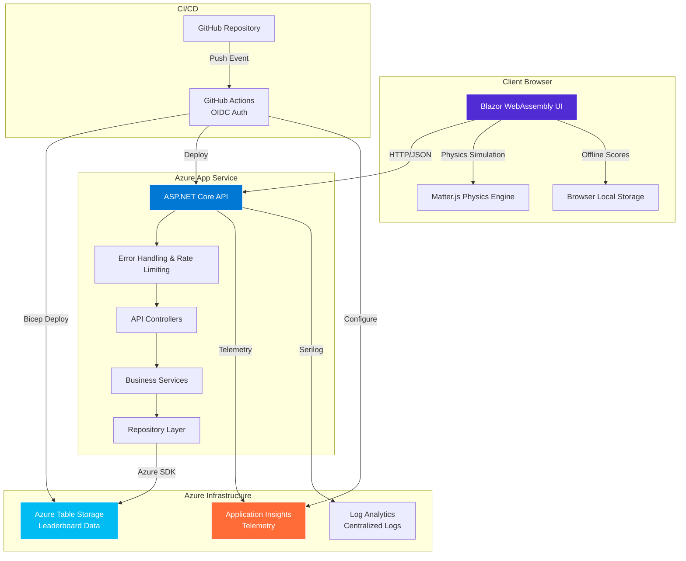
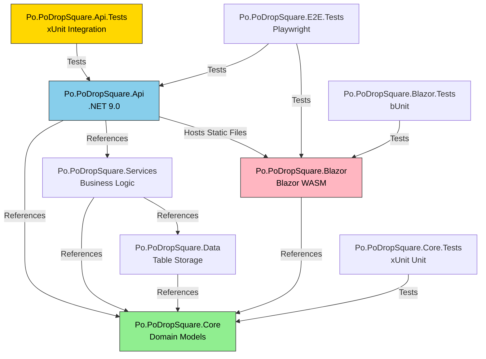
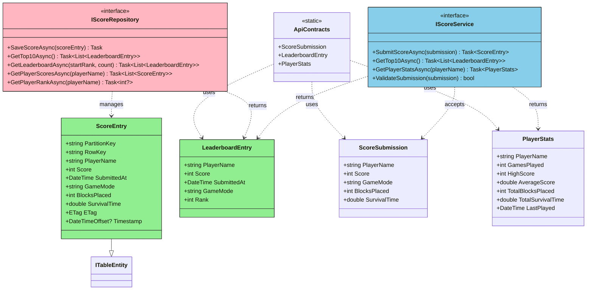
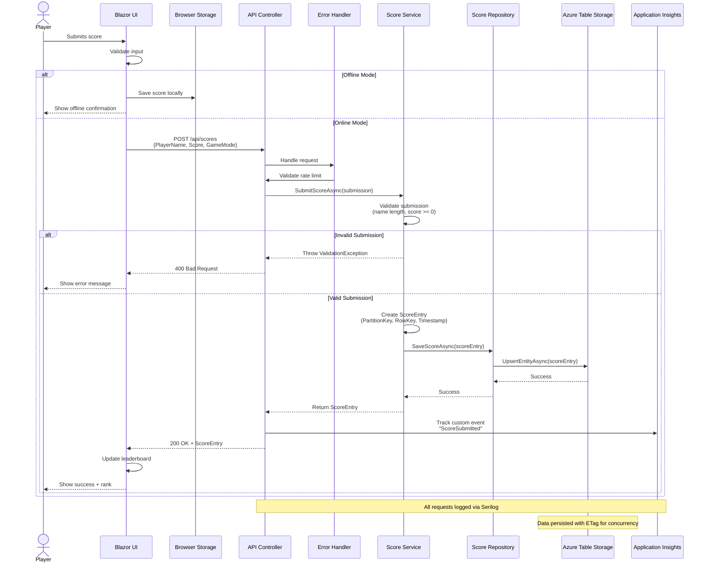
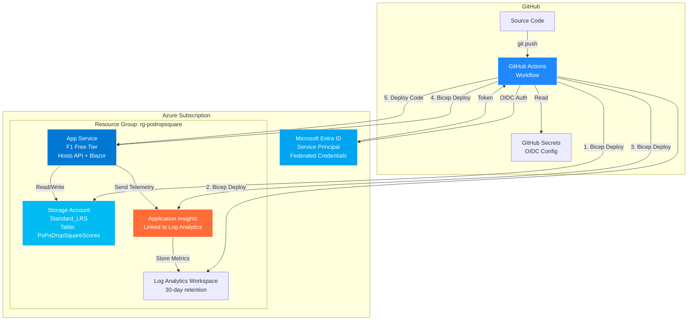
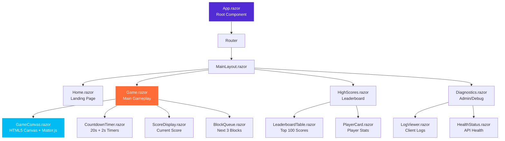
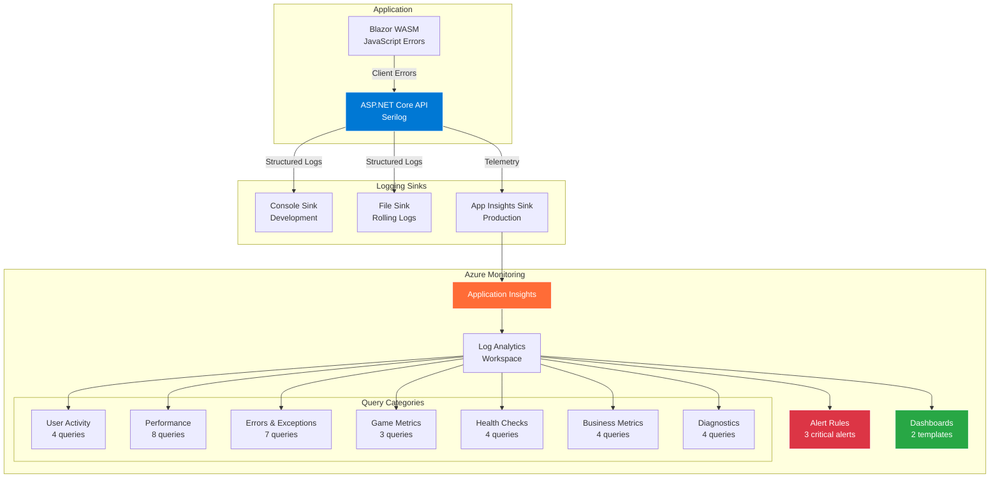
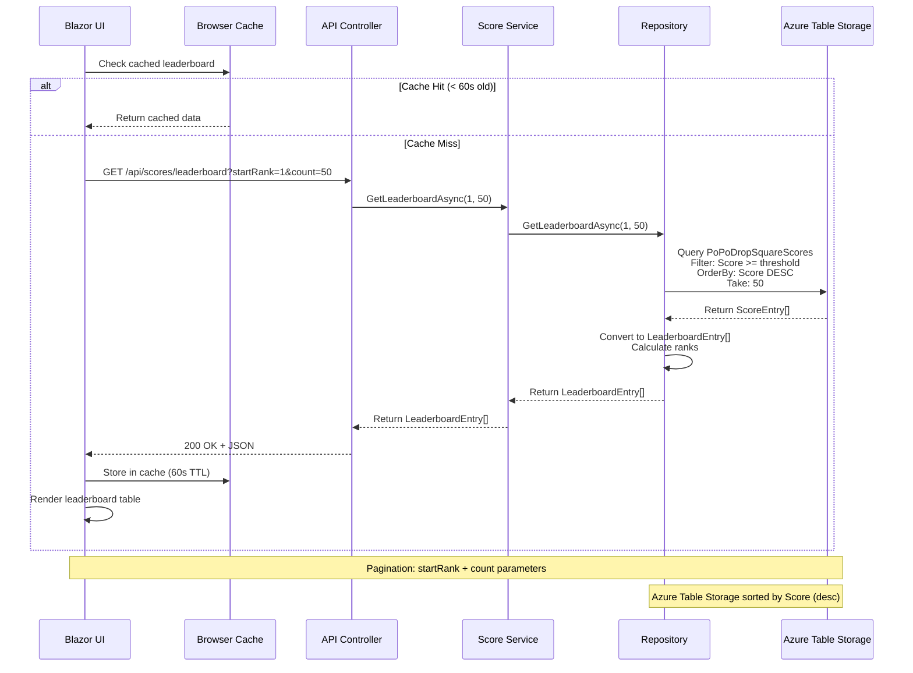
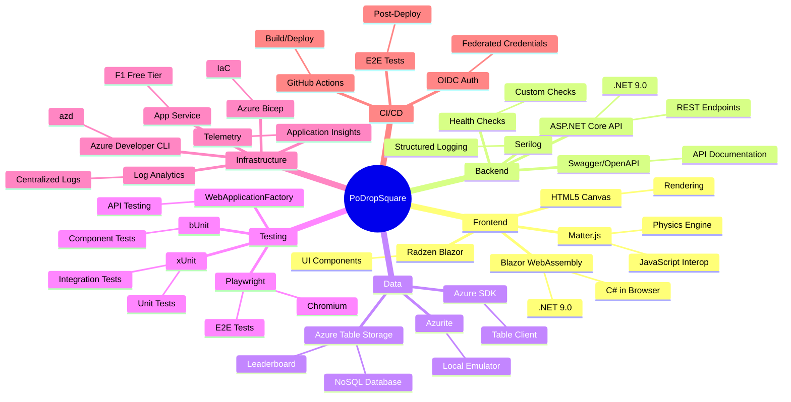

# PoDropSquare - Architecture Diagrams

> Mermaid diagrams documenting the system architecture, data flow, and component relationships

## 📊 Table of Contents

1. [System Architecture](#system-architecture)
2. [Project Dependency Graph](#project-dependency-graph)
3. [Class Diagram - Core Domain](#class-diagram---core-domain)
4. [Sequence Diagram - Score Submission](#sequence-diagram---score-submission)
5. [Deployment Architecture](#deployment-architecture)
6. [Component Hierarchy - Blazor UI](#component-hierarchy---blazor-ui)
7. [CI/CD Pipeline Flow](#cicd-pipeline-flow)
8. [Monitoring & Observability](#monitoring--observability)

---

## System Architecture

High-level overview of the PoDropSquare application architecture:

**Key Components:**
- **Client Browser**: Blazor WebAssembly SPA with Matter.js physics engine
- **Azure App Service**: ASP.NET Core API hosting both API and static Blazor files
- **Azure Table Storage**: NoSQL database for leaderboard persistence
- **Application Insights**: Real-time telemetry and monitoring
- **GitHub Actions**: Automated CI/CD with OIDC authentication

---

## Project Dependency Graph

Dependency relationships between projects in the solution:

**Dependency Rules:**
1. **Core** has zero external dependencies (pure domain)
2. **Data** depends only on Core
3. **Services** depends on Core and Data
4. **Api** depends on Services and Core (entry point)
5. **Blazor** depends only on Core (for DTOs)
6. **All tests** reference the project they test

---

## Class Diagram - Core Domain

Core domain entities and contracts:

**Key Entities:**
- **ScoreEntry**: Database entity (Azure Table Storage row)
- **LeaderboardEntry**: Read-optimized DTO for leaderboard display
- **ScoreSubmission**: Write-optimized DTO for score submission
- **PlayerStats**: Aggregated statistics for a player

---

## Sequence Diagram - Score Submission

Complete flow of a score submission from browser to database:

**Error Scenarios:**
1. **Validation Failure**: Returns `400 Bad Request` with Problem Details
2. **Rate Limit Exceeded**: Returns `429 Too Many Requests`
3. **Storage Error**: Returns `500 Internal Server Error` + logs exception
4. **Offline**: Saves to local storage, syncs when back online

---

## Deployment Architecture

Azure infrastructure and deployment flow:

**Deployment Steps:**
1. **Developer pushes code** to GitHub
2. **GitHub Actions triggered** by push event
3. **OIDC authentication** with Azure (no secrets!)
4. **Bicep deployment** provisions/updates infrastructure
5. **Code deployment** publishes to App Service
6. **Health check** verifies `/api/health` endpoint
7. **E2E tests** run against live deployment

**Cost Optimization:**
- **F1 App Service**: Free tier (1 GB RAM, 60 min/day CPU)
- **Storage**: Pay-per-use (~$0.05/GB/month)
- **Application Insights**: Free tier (5 GB/month)
- **Total**: ~$10-20/month

---

## Component Hierarchy - Blazor UI

Blazor WebAssembly component structure:

**Component Responsibilities:**
- **App.razor**: Root component, routing configuration
- **MainLayout.razor**: Navigation menu, header, footer
- **Game.razor**: Main game page, orchestrates gameplay components
- **GameCanvas.razor**: Renders physics simulation via Matter.js interop
- **Timer.razor**: Manages dual countdown timers (20s + 2s)
- **ScoreDisplay.razor**: Real-time score updates
- **LeaderboardTable.razor**: Paginated, sortable leaderboard
- **Diagnostics.razor**: Admin page for logs and health checks

---

## CI/CD Pipeline Flow

GitHub Actions workflow stages:

```mermaid
graph LR
    subgraph "Trigger"
        Push[git push<br/>main branch]
    end
    
    subgraph "Build Job"
        Checkout[Checkout Code]
        DotnetSetup[Setup .NET 9.0]
        Restore[dotnet restore]
        Build[dotnet build]
        Test[dotnet test<br/>48+ tests]
        Publish[dotnet publish]
    end
    
    subgraph "Deploy Job"
        AzdLogin[azd auth login<br/>OIDC]
        AzdProvision[azd provision<br/>Bicep]
        AzdDeploy[azd deploy<br/>App Service]
        HealthCheck[curl /api/health]
    end
    
    subgraph "E2E Test Job"
        PlaywrightSetup[Install Playwright]
        E2ETests[Run E2E Tests<br/>11 tests]
        Screenshots[Upload Screenshots]
    end
    
    Push --> Checkout
    Checkout --> DotnetSetup
    DotnetSetup --> Restore
    Restore --> Build
    Build --> Test
    Test --> Publish
    
    Publish --> AzdLogin
    AzdLogin --> AzdProvision
    AzdProvision --> AzdDeploy
    AzdDeploy --> HealthCheck
    
    HealthCheck --> PlaywrightSetup
    PlaywrightSetup --> E2ETests
    E2ETests --> Screenshots
    
    style Push fill:#2088FF,stroke:#fff,color:#fff
    style Test fill:#28A745,stroke:#fff,color:#fff
    style AzdDeploy fill:#0078D4,stroke:#fff,color:#fff
    style E2ETests fill:#FF6C37,stroke:#fff,color:#fff
```

**Pipeline Stages:**

1. **Build** (~2 min)
   - Restore NuGet packages
   - Compile all 8 projects
   - Run 48+ unit/integration tests
   - Publish artifacts

2. **Deploy** (~5 min)
   - Authenticate with Azure (OIDC)
   - Provision infrastructure (Bicep)
   - Deploy API + Blazor to App Service
   - Verify health endpoint

3. **E2E Test** (~3 min)
   - Install Playwright browsers
   - Run 11 end-to-end tests
   - Capture screenshots on failure
   - Upload artifacts

**Security:** Uses OIDC federated credentials - no long-lived secrets!

---

## Monitoring & Observability

Telemetry and logging architecture:

**Monitoring Components:**

1. **Serilog** - Structured logging with multiple sinks
   - Console: Real-time development logs
   - File: Rolling file logs (30-day retention)
   - Application Insights: Production telemetry

2. **Application Insights** - Real-time telemetry
   - Request/response tracking
   - Exception logging
   - Custom events (game scores, user actions)
   - Client-side error tracking
   - Performance counters

3. **31 KQL Queries** (see `docs/KQL-QUERIES.md`)
   - User Activity: Active users, sessions, geography
   - Performance: Latency, slow queries, client load times
   - Errors: Exceptions, failures, JS errors
   - Game Metrics: Score submissions, leaderboard
   - Health: Uptime, availability, dependency health
   - Business: DAU, retention, peak times
   - Diagnostics: Duration distribution, throttling

4. **Alerts** (3 critical)
   - Error rate > 5% (last 5 min)
   - API response time > 1000ms (last 5 min)
   - Dependency failures detected

5. **Dashboards** (2 templates)
   - Real-time monitoring (live metrics)
   - Weekly summary (trends, top errors)

---

## Data Flow - Leaderboard Lookup

How leaderboard data flows through the system:

**Optimization Strategies:**
- **Client-side caching**: 60-second TTL reduces API calls
- **Pagination**: Load only visible rows (50 at a time)
- **Indexed queries**: Azure Table Storage partition/row key optimization
- **Minimal DTOs**: LeaderboardEntry vs full ScoreEntry

---

## Technology Stack Overview

Complete technology breakdown:

---

## Summary

These diagrams provide comprehensive visual documentation of the PoDropSquare architecture:

1. **System Architecture** - High-level component overview
2. **Project Dependencies** - Code organization and references
3. **Class Diagram** - Core domain model
4. **Sequence Diagrams** - Request/response flows
5. **Deployment** - Azure infrastructure and CI/CD
6. **Component Hierarchy** - Blazor UI structure
7. **Monitoring** - Observability and telemetry
8. **Data Flow** - End-to-end data processing

**Viewing These Diagrams:**
- **GitHub**: Renders Mermaid natively in markdown
- **VS Code**: Install "Markdown Preview Mermaid Support" extension
- **Browser**: Use [Mermaid Live Editor](https://mermaid.live/)

**Keeping Updated:**
- Update diagrams when adding new components
- Document new API endpoints in sequence diagrams
- Add new Azure resources to deployment diagram
- Keep class diagram in sync with domain models

---

**Built with ❤️ using Mermaid diagrams for visual documentation**
