# High Score Logic Documentation

## 📊 Overview

The high score system tracks player performance based on **survival time** (how long blocks remain standing) rather than traditional point scoring. The longer a tower survives, the higher the score.

## 🎯 How It Works

### 1. Score Calculation

**Score = Survival Time in Seconds**

- **Minimum**: 0.05s (50ms - anti-cheat minimum reaction time)
- **Maximum**: 20.0s (maximum reasonable survival time)
- **Victory**: Achieving exactly 20.0s triggers the victory condition

### 2. Game Flow

```mermaid
graph TD
    A[Game Start] --> B[Player Drops Blocks]
    B --> C{Tower Stable?}
    C -->|Yes| D[Timer Continues]
    C -->|No| E[Game Over]
    D --> F{20s Reached?}
    F -->|Yes| G[🏆 Victory!]
    F -->|No| H{Block Reaches Top?}
    H -->|Yes| I[Danger Countdown: 2s]
    H -->|No| D
    I --> J{Countdown Expires?}
    J -->|Yes| E
    J -->|No| K{Block Removed?}
    K -->|Yes| D
    K -->|No| I
    E --> L[Submit Score to API]
    G --> L
    L --> M[Update Leaderboard]
```



### 3. Score Submission Process

#### Step 1: Game Ends
When the game ends (either victory or game over), the `OnVictoryAchieved` or `OnDangerGameOver` JavaScript function is called.

#### Step 2: JavaScript → C# Interop
```javascript
// physics-engine.js line 799
OnVictoryAchieved: function(survivalTimeSeconds) {
    this.dotNetReference.invokeMethodAsync('OnVictoryAchieved', survivalTimeSeconds);
}
```

#### Step 3: C# Receives Event
```csharp
// GameCanvas.razor line 332
[JSInvokable]
public async Task OnVictoryAchieved(double survivalTimeSeconds) {
    await OnGameEvent.InvokeAsync(new GameEventArgs 
    { 
        EventType = GameEventType.GoalReached, 
        Score = _currentScore,
        Data = survivalTimeSeconds
    });
}
```

#### Step 4: Display Score Modal
```csharp
// Game.razor
private async Task HandleGameEvent(GameEventArgs args) {
    if (args.EventType == GameEventType.GoalReached) {
        ShowScoreSubmissionModal = true;
        // Show modal with survival time
    }
}
```

#### Step 5: Submit to API
```csharp
// ScoreSubmissionModal.razor line 260
var response = await Http.PostAsJsonAsync("/api/scores", new {
    playerInitials = playerName,
    survivalTime = Score,
    sessionSignature = SessionId,
    clientTimestamp = DateTime.UtcNow
});
```

#### Step 6: Server Validation
```csharp
// ScoreService.cs
public async Task<object> SubmitScoreAsync(ScoreSubmissionRequest request) {
    // 1. Validate survival time (0.05s - 20.0s)
    // 2. Check for duplicate submissions
    // 3. Rate limiting (5 per minute, 50 per hour)
    // 4. Create score entry
    // 5. Save to Azure Table Storage
    // 6. Update leaderboard if qualified
    // 7. Return rank and qualification status
}
```

#### Step 7: Leaderboard Update
```csharp
// LeaderboardRepository.cs
public async Task<LeaderboardEntry?> UpdateLeaderboardAsync(ScoreEntry scoreEntry) {
    // 1. Get top 10 current scores
    // 2. Check if new score qualifies
    // 3. Insert or update leaderboard entry
    // 4. Return rank information
}
```

### 4. Leaderboard Display

The leaderboard shows:
- **Rank** (#1-#10 with medals 🥇🥈🥉)
- **Player Initials** (1-3 characters)
- **Survival Time** (formatted as X.XX seconds)
- **Timestamp** (when submitted)

#### Frontend Refresh
```csharp
// LeaderboardDisplay.razor
public async Task RefreshLeaderboard() {
    var response = await Http.GetAsync("/api/scores/top10");
    var apiResponse = await response.Content.ReadFromJsonAsync<LeaderboardApiResponse>();
    Entries = apiResponse.Leaderboard;
}
```

#### API Endpoint
```csharp
// ScoresController.cs line 204
[HttpGet("top10")]
public async Task<IActionResult> GetTop10Leaderboard([FromQuery] string? playerInitials) {
    var leaderboard = await _leaderboardService.GetTopLeaderboardAsync(10);
    
    return Ok(new {
        Success = true,
        Leaderboard = leaderboard.Leaderboard,
        LastUpdated = leaderboard.LastUpdated
    });
}
```

## 🔒 Anti-Cheat Measures

### 1. Validation Rules
- ✅ Minimum survival time: 50ms (human reaction limit)
- ✅ Maximum survival time: 20.0s (game goal)
- ✅ Session signature validation
- ✅ Timestamp validation (within 5 minutes)

### 2. Rate Limiting
- **Per Minute**: Maximum 5 submissions
- **Per Hour**: Maximum 50 submissions

### 3. Duplicate Detection
```csharp
// ScoreService.cs
var recentScores = await _scoreRepository.GetPlayerScoresAsync(
    request.PlayerInitials, 
    DateTime.UtcNow.AddMinutes(-1)
);

if (recentScores.Any(s => Math.Abs(s.SurvivalTime - request.SurvivalTime) < 0.01)) {
    return new ScoreSubmissionErrorResponse {
        Error = "DUPLICATE_SCORE",
        Message = "Duplicate score detected"
    };
}
```

## 📡 API Contracts

### POST /api/scores
**Request:**
```json
{
  "playerInitials": "ABC",
  "survivalTime": 15.43,
  "sessionSignature": "sha256_hash",
  "clientTimestamp": "2025-11-07T21:00:00Z"
}
```

**Response (201 Created):**
```json
{
  "success": true,
  "scoreId": "abc-123-def",
  "leaderboardPosition": 3,
  "qualifiedForLeaderboard": true,
  "message": "🎉 New personal best! Ranked #3",
  "metadata": {
    "isPersonalBest": true,
    "previousBest": 12.50,
    "improvement": 2.93,
    "totalSubmissions": 5
  }
}
```

### GET /api/scores/top10
**Response (200 OK):**
```json
{
  "success": true,
  "leaderboard": [
    {
      "rank": 1,
      "playerInitials": "PRO",
      "playerName": "PRO",
      "survivalTime": 20.00,
      "score": 2000,
      "submittedAt": "2025-11-07T21:00:00Z"
    },
    {
      "rank": 2,
      "playerInitials": "ACE",
      "playerName": "ACE",
      "survivalTime": 18.75,
      "score": 1875,
      "submittedAt": "2025-11-07T20:55:00Z"
    }
  ],
  "lastUpdated": "2025-11-07T21:05:00Z",
  "totalEntries": 2
}
```

## 🗄️ Data Storage

### Azure Table Storage Schema

#### Scores Table
| PartitionKey | RowKey | PlayerInitials | SurvivalTime | Score | SubmittedAt |
|--------------|--------|----------------|--------------|-------|-------------|
| ABC | 2025-11-07_210000_guid | ABC | 15.43 | 1543 | 2025-11-07T21:00:00Z |

#### Leaderboard Table
| PartitionKey | RowKey | PlayerInitials | HighScore | Rank | LastUpdated |
|--------------|--------|----------------|-----------|------|-------------|
| LEADERBOARD | 00001 | PRO | 20.00 | 1 | 2025-11-07T21:00:00Z |
| LEADERBOARD | 00002 | ACE | 18.75 | 2 | 2025-11-07T20:55:00Z |

## 🐛 Fixed Errors

### Error 1: DotNetObjectReference Disposed
**Symptom:** "There is no tracked object with id '2'"

**Cause:** DotNetObjectReference was being disposed while JavaScript was still trying to call C# methods.

**Fix:** 
```csharp
// GameCanvas.razor DisposeAsync()
// 1. Stop the game first
await JSRuntime.InvokeVoidAsync("stopGame");
await Task.Delay(100); // Give JS time to finish
await JSRuntime.InvokeVoidAsync("cleanup");

// 2. Dispose DotNetObjectReference LAST
_dotNetRef?.Dispose();
```

### Error 2: OnVictoryAchieved Parameter Mismatch
**Symptom:** "The call to 'OnVictoryAchieved' expects '1' parameters, but received '0'"

**Cause:** JavaScript function wasn't passing `survivalTimeSeconds` parameter.

**Fix:**
```javascript
// physics-engine.js line 799
OnVictoryAchieved: function(survivalTimeSeconds) {
    this.dotNetReference.invokeMethodAsync('OnVictoryAchieved', survivalTimeSeconds);
}
```

## 🧪 Testing the High Score Flow

### Manual Test Steps
1. **Start game** at http://localhost:5000
2. **Drop blocks** and build a stable tower
3. **Wait for victory** (survive 20 seconds)
4. **Enter initials** in score modal
5. **Submit score** and verify success message
6. **Check leaderboard** at http://localhost:5000/highscores
7. **Verify rank** appears correctly

### API Test (Using .http file)
```http
### Submit a score
POST http://localhost:5000/api/scores
Content-Type: application/json

{
  "playerInitials": "TST",
  "survivalTime": 15.50,
  "sessionSignature": "test-session-123",
  "clientTimestamp": "{{$datetime iso8601}}"
}

### Get leaderboard
GET http://localhost:5000/api/scores/top10
```

## 📚 Related Files

| File | Purpose |
|------|---------|
| `frontend/src/Po.PoDropSquare.Blazor/Components/GameCanvas.razor` | Game logic & JS interop |
| `frontend/src/Po.PoDropSquare.Blazor/Components/ScoreSubmissionModal.razor` | Score submission UI |
| `frontend/src/Po.PoDropSquare.Blazor/Components/LeaderboardDisplay.razor` | Leaderboard UI |
| `frontend/src/Po.PoDropSquare.Blazor/wwwroot/js/physics-engine.js` | Game engine & victory detection |
| `backend/src/Po.PoDropSquare.Api/Controllers/ScoresController.cs` | API endpoints |
| `backend/src/Po.PoDropSquare.Services/Services/ScoreService.cs` | Business logic & validation |
| `backend/src/Po.PoDropSquare.Data/Repositories/ScoreRepository.cs` | Data persistence |
| `backend/src/Po.PoDropSquare.Data/Repositories/LeaderboardRepository.cs` | Leaderboard management |

---

**Created:** 2025-11-07  
**Status:** ✅ Working (DotNetObjectReference error fixed)
