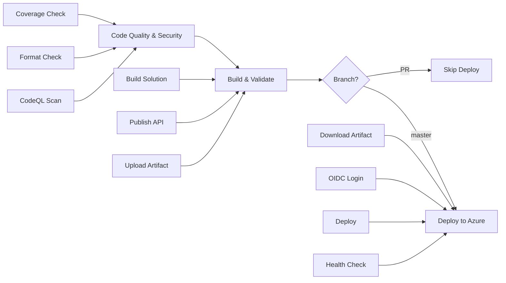

# Phase 4: CI/CD Pipeline - Setup & Configuration Guide

## 📋 Overview

Comprehensive GitHub Actions CI/CD pipeline with **security scanning**, **code quality checks**, and **automated Azure deployment** using OIDC authentication.

## 🎯 Objectives

- ✅ **Security Scanning**: CodeQL static analysis for vulnerabilities
- ✅ **Code Quality**: Automated formatting verification with `dotnet format`
- ✅ **Coverage Validation**: Verify coverage reports are generated and committed
- ✅ **Build Validation**: Multi-stage build with artifact management
- ✅ **OIDC Authentication**: Passwordless Azure deployment
- ✅ **Health Verification**: Post-deployment health checks
- ✅ **PR Validation**: Run checks on pull requests without deploying

## 📦 Pipeline Architecture

### Workflow Structure (3 Jobs)



### Job 1: Code Quality & Security

**Purpose**: Security scanning and code quality validation  
**Runs on**: All pushes and PRs  
**Duration**: ~3-5 minutes

| Step | What It Does | Failure Impact |
|------|--------------|----------------|
| **CodeQL Init** | Initializes security scanning | Blocks pipeline |
| **Build** | Compiles code for analysis | Blocks pipeline |
| **CodeQL Analyze** | Scans for security vulnerabilities | Blocks pipeline |
| **Format Check** | Verifies code formatting with `dotnet format --verify-no-changes` | Blocks pipeline |
| **Coverage Check** | Verifies `docs/coverage/index.html` exists | Warning only |

**CodeQL Queries**:
- `security-extended` - Common security vulnerabilities (SQL injection, XSS, etc.)
- `security-and-quality` - Code quality issues (unused code, complexity, etc.)

### Job 2: Build & Validate

**Purpose**: Build solution and create deployment artifacts  
**Runs on**: All pushes and PRs (after code quality passes)  
**Duration**: ~2-3 minutes

| Step | What It Does | Output |
|------|--------------|--------|
| **Restore** | `dotnet restore` | NuGet packages downloaded |
| **Build** | `dotnet build --configuration Release` | Compiled assemblies |
| **Publish** | `dotnet publish` to `./publish` | Deployment-ready files |
| **Upload Artifact** | Store publish output | Artifact for deployment job |

**Artifact Details**:
- **Name**: `api-publish`
- **Retention**: 7 days
- **Contents**: All files needed to run API (DLLs, wwwroot, appsettings.json)

### Job 3: Deploy to Azure

**Purpose**: Deploy to Azure App Service and verify  
**Runs on**: `master` branch pushes only  
**Duration**: ~1-2 minutes

| Step | What It Does | Verification |
|------|--------------|--------------|
| **Download Artifact** | Retrieve `api-publish` from build job | Files in `./publish` |
| **OIDC Login** | Authenticate to Azure (no passwords!) | Azure CLI logged in |
| **Deploy** | Upload files to App Service | Files deployed |
| **Health Check** | `curl` health endpoint (after 30s delay) | 200 OK response |
| **Endpoint Test** | Verify leaderboard API works | JSON response |
| **Summary** | Generate deployment report | GitHub step summary |

**Environment**: `production` (configured in GitHub repository settings)

## 🔧 Setup Instructions

### Prerequisites

1. **Azure Resources**:
   - Azure App Service (already exists: `PoDropSquare`)
   - Azure AD App Registration with federated credentials
   - Subscription with Contributor access

2. **GitHub Repository**:
   - Repository: `punkouter26/PoDropSquare`
   - Admin access to configure secrets and environments

### Step 1: Configure OIDC in Azure

OIDC (OpenID Connect) allows GitHub Actions to authenticate to Azure **without storing passwords or service principal secrets**.

#### 1.1 Create Azure AD App Registration

```bash
# Login to Azure
az login

# Create app registration
az ad app create \
  --display-name "GitHub-PoDropSquare-OIDC" \
  --sign-in-audience "AzureADMyOrg"

# Save the Application (client) ID - you'll need this
APP_ID=$(az ad app list --display-name "GitHub-PoDropSquare-OIDC" --query "[0].appId" -o tsv)
echo "Application ID: $APP_ID"
```

#### 1.2 Create Service Principal

```bash
# Create service principal from app registration
az ad sp create --id $APP_ID

# Get the Object ID of the service principal (not the app!)
SP_OBJECT_ID=$(az ad sp list --display-name "GitHub-PoDropSquare-OIDC" --query "[0].id" -o tsv)
echo "Service Principal Object ID: $SP_OBJECT_ID"
```

#### 1.3 Assign Azure Permissions

```bash
# Get your subscription ID
SUBSCRIPTION_ID=$(az account show --query id -o tsv)
echo "Subscription ID: $SUBSCRIPTION_ID"

# Assign Contributor role to service principal for the App Service resource group
RESOURCE_GROUP="rg-PoDropSquare"  # Update with your resource group name

az role assignment create \
  --assignee $APP_ID \
  --role "Contributor" \
  --scope "/subscriptions/$SUBSCRIPTION_ID/resourceGroups/$RESOURCE_GROUP"

echo "✅ Service principal has Contributor access to $RESOURCE_GROUP"
```

#### 1.4 Configure Federated Credentials

This tells Azure to trust GitHub Actions tokens for authentication.

```bash
# Get your tenant ID
TENANT_ID=$(az account show --query tenantId -o tsv)
echo "Tenant ID: $TENANT_ID"

# Create federated credential for main branch
az ad app federated-credential create \
  --id $APP_ID \
  --parameters '{
    "name": "GitHub-PoDropSquare-Master",
    "issuer": "https://token.actions.githubusercontent.com",
    "subject": "repo:punkouter26/PoDropSquare:ref:refs/heads/master",
    "description": "GitHub Actions OIDC for master branch",
    "audiences": ["api://AzureADTokenExchange"]
  }'

# Create federated credential for pull requests (optional)
az ad app federated-credential create \
  --id $APP_ID \
  --parameters '{
    "name": "GitHub-PoDropSquare-PR",
    "issuer": "https://token.actions.githubusercontent.com",
    "subject": "repo:punkouter26/PoDropSquare:pull_request",
    "description": "GitHub Actions OIDC for pull requests",
    "audiences": ["api://AzureADTokenExchange"]
  }'

echo "✅ Federated credentials configured"
```

#### 1.5 Save Configuration Values

You now have three values needed for GitHub:

```bash
echo "==================================="
echo "GitHub Configuration Values"
echo "==================================="
echo "AZURE_CLIENT_ID:       $APP_ID"
echo "AZURE_TENANT_ID:       $TENANT_ID"
echo "AZURE_SUBSCRIPTION_ID: $SUBSCRIPTION_ID"
echo "==================================="
echo "Save these for the next step!"
```

### Step 2: Configure GitHub Repository

#### 2.1 Add Repository Variables

1. Go to **GitHub Repository** → **Settings** → **Secrets and variables** → **Actions**
2. Click **Variables** tab → **New repository variable**
3. Add these three variables:

| Name | Value | Description |
|------|-------|-------------|
| `AZURE_CLIENT_ID` | `<APP_ID from above>` | Application (client) ID |
| `AZURE_TENANT_ID` | `<TENANT_ID from above>` | Azure AD tenant ID |
| `AZURE_SUBSCRIPTION_ID` | `<SUBSCRIPTION_ID from above>` | Azure subscription ID |

**Why variables instead of secrets?**
- These are non-sensitive IDs (not passwords)
- Variables are visible in workflow logs (helpful for debugging)
- Aligns with Microsoft's OIDC best practices

#### 2.2 Create Production Environment

1. Go to **GitHub Repository** → **Settings** → **Environments**
2. Click **New environment**
3. Name: `production`
4. Click **Configure environment**
5. **Environment protection rules** (optional but recommended):
   - ☑️ **Required reviewers**: Add yourself or team members
   - ☑️ **Wait timer**: 0 minutes (or add delay if desired)
   - ☑️ **Deployment branches**: Selected branches → `master`
6. Click **Save protection rules**

**Environment Configuration**:
```yaml
Name: production
URL: https://podropsquare.azurewebsites.net
Protection rules:
  - Required reviewers: 1 (optional)
  - Deployment branches: master only
  - Wait timer: 0 minutes
```

#### 2.3 Enable GitHub Actions

1. Go to **Settings** → **Actions** → **General**
2. **Actions permissions**: ✅ Allow all actions and reusable workflows
3. **Workflow permissions**:
   - ✅ Read and write permissions
   - ☑️ Allow GitHub Actions to create and approve pull requests
4. Click **Save**

### Step 3: Verify Workflow Configuration

#### 3.1 Check Workflow File

File: `.github/workflows/azure-dev.yml`

**Key sections**:
```yaml
permissions:
  id-token: write      # Required for OIDC
  contents: read       # Required to checkout code
  security-events: write  # Required for CodeQL
  actions: read        # Required for CodeQL

env:
  DOTNET_VERSION: '9.0.x'
  SOLUTION_PATH: 'PoDropSquare.sln'
  API_PROJECT_PATH: 'backend/src/Po.PoDropSquare.Api/Po.PoDropSquare.Api.csproj'
  PUBLISH_OUTPUT: './publish'
```

#### 3.2 Test the Pipeline

**Option 1: Push to master branch**
```bash
git add .
git commit -m "Enable CI/CD pipeline"
git push origin master
```

**Option 2: Manual trigger (workflow_dispatch)**
1. Go to **Actions** tab in GitHub
2. Select **CI/CD Pipeline** workflow
3. Click **Run workflow** → **Run workflow**

### Step 4: Monitor Pipeline Execution

#### 4.1 View Workflow Run

1. Go to **Actions** tab
2. Click on the running workflow
3. View progress:
   - ✅ **Code Quality & Security** (3-5 min)
   - ✅ **Build & Validate** (2-3 min)
   - ✅ **Deploy to Azure** (1-2 min) - master branch only

#### 4.2 Check Job Outputs

**Code Quality & Security**:
```
🔍 Initialize CodeQL
✅ CodeQL database created
🔎 Perform CodeQL Analysis
✅ No security issues found
✨ Verify code formatting
✅ Code formatting verified
📊 Verify coverage report exists
✅ Coverage report found at docs/coverage/index.html
```

**Build & Validate**:
```
📦 Restore dependencies
✅ Restored 47 packages
🏗️ Build solution
✅ Build succeeded
📦 Publish API project
✅ Published to ./publish
📂 Upload publish artifact
✅ Artifact uploaded: api-publish (12.3 MB)
```

**Deploy to Azure** (master branch only):
```
📥 Download publish artifact
✅ Downloaded api-publish
🔐 Log in to Azure with OIDC
✅ Logged in to Azure subscription
🚀 Deploy to Azure App Service
✅ Deployment successful
🏥 Verify deployment health check
✅ Health check passed! Status code: 200
🧪 Verify API endpoints
✅ Leaderboard endpoint responding
```

#### 4.3 Deployment Summary

After successful deployment, see summary in **Actions** → **Workflow run** → **Deploy to Azure App Service** → **Summary**:

```markdown
## 🎉 Deployment Successful

- **Environment**: Production
- **App Service**: PoDropSquare
- **URL**: https://podropsquare.azurewebsites.net
- **Health Check**: ✅ Passed
- **API Version**: .NET 9.0.x

### 🔗 Quick Links
- [Live Application](https://podropsquare.azurewebsites.net)
- [Health Check](https://podropsquare.azurewebsites.net/api/health)
- [Leaderboard API](https://podropsquare.azurewebsites.net/api/scores/top10)
```

## 🔒 Security Features

### 1. CodeQL Static Analysis

**Scans for**:
- SQL injection vulnerabilities
- Cross-site scripting (XSS)
- Command injection
- Path traversal
- Insecure deserialization
- Use of weak cryptography
- Hard-coded credentials
- Unvalidated redirects

**Query suites**:
- `security-extended` - Common security vulnerabilities
- `security-and-quality` - Code quality and best practices

**Results**: Available in **Security** → **Code scanning alerts**

### 2. OIDC Authentication (No Secrets!)

**Traditional approach** (❌ NOT USED):
- Store Azure Service Principal password in GitHub Secrets
- Risk of credential leakage
- Requires secret rotation

**OIDC approach** (✅ USED):
- GitHub generates short-lived tokens
- Azure validates token issuer and subject
- No long-lived credentials stored
- Automatic token expiration (1 hour)

**Security benefits**:
- 🔒 No passwords in GitHub Secrets
- 🔄 Tokens expire automatically
- 🎯 Scoped to specific repository and branch
- 📊 Full audit trail in Azure AD

### 3. Least Privilege Access

Service principal has **Contributor** role scoped to:
- Specific resource group only
- Cannot access other subscriptions
- Cannot modify Azure AD settings
- Cannot create/delete resource groups

### 4. Environment Protection

`production` environment configured with:
- ✅ Manual approval requirement (optional)
- ✅ Deployment branch restrictions (master only)
- ✅ Wait timer (configurable delay)
- ✅ Deployment history tracking

## 📊 Pipeline Triggers

### Automatic Triggers

| Event | Jobs Run | Deploy? | Purpose |
|-------|----------|---------|---------|
| **Push to `master`** | All 3 jobs | ✅ Yes | Deploy to production |
| **Pull Request** | Jobs 1 & 2 only | ❌ No | Validate changes |
| **Manual (workflow_dispatch)** | All 3 jobs | ✅ Yes (master only) | On-demand deployment |

### Branch Protection Recommendations

Configure branch protection for `master`:

1. Go to **Settings** → **Branches** → **Add branch protection rule**
2. Branch name pattern: `master`
3. **Protection settings**:
   - ☑️ Require pull request reviews (1 approval)
   - ☑️ Require status checks to pass before merging
     - Required checks: `Code Quality & Security`, `Build & Validate`
   - ☑️ Require branches to be up to date before merging
   - ☑️ Require conversation resolution before merging
   - ☑️ Include administrators
4. Click **Create**

**Effect**: Cannot push directly to master without passing CI checks

## 🐛 Troubleshooting

### Issue 1: CodeQL Analysis Fails

**Error**: `Unable to initialize CodeQL database`

**Solution**:
```bash
# Ensure all projects build successfully locally
dotnet build PoDropSquare.sln --configuration Release

# Check for build errors
dotnet build --no-incremental --verbosity diagnostic
```

### Issue 2: Format Check Fails

**Error**: `Run dotnet format found unformatted files`

**Solution**:
```bash
# Format all files locally
dotnet format PoDropSquare.sln

# Verify formatting
dotnet format PoDropSquare.sln --verify-no-changes

# Commit formatted files
git add .
git commit -m "Apply code formatting"
git push
```

### Issue 3: OIDC Authentication Fails

**Error**: `AADSTS70021: No matching federated identity record found`

**Possible causes**:
1. Federated credential subject doesn't match repository
2. Wrong branch name in subject claim
3. Federated credential not created

**Solution**:
```bash
# Verify federated credentials
az ad app federated-credential list --id $APP_ID

# Expected subject for master branch:
# repo:punkouter26/PoDropSquare:ref:refs/heads/master

# If wrong, delete and recreate:
az ad app federated-credential delete \
  --id $APP_ID \
  --federated-credential-id <CREDENTIAL_ID>

az ad app federated-credential create \
  --id $APP_ID \
  --parameters '{
    "name": "GitHub-PoDropSquare-Master",
    "issuer": "https://token.actions.githubusercontent.com",
    "subject": "repo:punkointer26/PoDropSquare:ref:refs/heads/master",
    "audiences": ["api://AzureADTokenExchange"]
  }'
```

### Issue 4: Deployment Health Check Fails

**Error**: `Health check failed! Status code: 503`

**Possible causes**:
1. App still starting (30s delay may not be enough)
2. Application error during startup
3. App Service plan stopped/deallocated

**Solution**:
```bash
# Check App Service logs in Azure Portal
az webapp log tail --name PoDropSquare --resource-group rg-PoDropSquare

# Or increase wait time in workflow:
# Change: sleep 30
# To:     sleep 60
```

### Issue 5: Coverage Report Not Found

**Warning**: `Coverage report not found at docs/coverage/index.html`

**Impact**: Warning only, pipeline continues

**Solution**:
```powershell
# Generate coverage report locally
.\scripts\generate-coverage.ps1

# Commit the report
git add docs/coverage/
git commit -m "Add coverage report"
git push
```

## 📈 Metrics & Monitoring

### Pipeline Metrics

**Typical execution times**:
- Code Quality & Security: 3-5 minutes
- Build & Validate: 2-3 minutes
- Deploy to Azure: 1-2 minutes
- **Total**: 6-10 minutes

**Success rate targets**:
- ✅ Code quality: 100% (fix failures before merging)
- ✅ Build: 100% (builds must succeed)
- ✅ Deployment: 95%+ (allow for transient Azure issues)

### Monitoring Deployment Success

**Health check endpoint**: `https://podropsquare.azurewebsites.net/api/health`

**Expected response**:
```json
{
  "status": "Healthy",
  "checks": {
    "azure_table_storage": "Healthy"
  }
}
```

**Monitor in Application Insights**:
```kql
requests
| where timestamp > ago(1h)
| where url contains "/api/health"
| summarize Count = count(), AvgDuration = avg(duration) by resultCode
| order by Count desc
```

## 🔄 Maintenance

### Updating .NET Version

When upgrading to .NET 10.0:

1. **Update workflow**:
   ```yaml
   env:
     DOTNET_VERSION: '10.0.x'  # Changed from 9.0.x
   ```

2. **Update global.json**:
   ```json
   {
     "sdk": {
       "version": "10.0.100",
       "rollForward": "latestFeature"
     }
   }
   ```

3. **Test locally** → Commit → Push

### Adding New Jobs

Example: Add integration tests job

```yaml
jobs:
  integration-tests:
    name: Integration Tests
    runs-on: ubuntu-latest
    needs: build
    
    services:
      azurite:
        image: mcr.microsoft.com/azure-storage/azurite
        ports:
          - 10000:10000
          - 10001:10001
          - 10002:10002
    
    steps:
      - name: Checkout code
        uses: actions/checkout@v4
      
      - name: Setup .NET
        uses: actions/setup-dotnet@v4
        with:
          dotnet-version: ${{ env.DOTNET_VERSION }}
      
      - name: Run integration tests
        run: |
          dotnet test backend/tests/Po.PoDropSquare.Api.Tests/ \
            --filter Category=Integration \
            --configuration Release \
            --logger "trx;LogFileName=integration-tests.trx"
      
      - name: Upload test results
        if: always()
        uses: actions/upload-artifact@v4
        with:
          name: integration-test-results
          path: '**/integration-tests.trx'
```

### Rotating OIDC Credentials

OIDC tokens expire automatically (no rotation needed), but if you need to recreate the app registration:

```bash
# Delete old federated credentials
az ad app federated-credential list --id $OLD_APP_ID
az ad app federated-credential delete --id $OLD_APP_ID --federated-credential-id <ID>

# Delete service principal
az ad sp delete --id $OLD_APP_ID

# Delete app registration
az ad app delete --id $OLD_APP_ID

# Then follow setup instructions to create new one
```

## 📚 References

- **GitHub Actions**: https://docs.github.com/en/actions
- **OIDC with Azure**: https://docs.github.com/en/actions/deployment/security-hardening-your-deployments/configuring-openid-connect-in-azure
- **CodeQL**: https://codeql.github.com/docs/
- **Azure App Service Deployment**: https://learn.microsoft.com/azure/app-service/deploy-github-actions
- **Dotnet Format**: https://learn.microsoft.com/dotnet/core/tools/dotnet-format

## 📝 Summary

Phase 4 provides **enterprise-grade CI/CD** with:

- ✅ **3-job pipeline** (quality → build → deploy)
- ✅ **CodeQL security scanning** (security-extended + security-and-quality)
- ✅ **Automated format verification** (`dotnet format --verify-no-changes`)
- ✅ **Coverage validation** (checks `docs/coverage/index.html` exists)
- ✅ **OIDC authentication** (no passwords stored)
- ✅ **Environment protection** (manual approval for production)
- ✅ **Health verification** (post-deployment checks)
- ✅ **PR validation** (runs checks without deploying)
- ✅ **Deployment summary** (links to live app, health check, APIs)

**Execution time**: 6-10 minutes total  
**Security**: Zero long-lived credentials stored  
**Reliability**: Multi-stage validation with health checks

---

**Phase 4 Status**: ✅ **COMPLETE** - Ready for Phase 5 (Advanced Telemetry)
